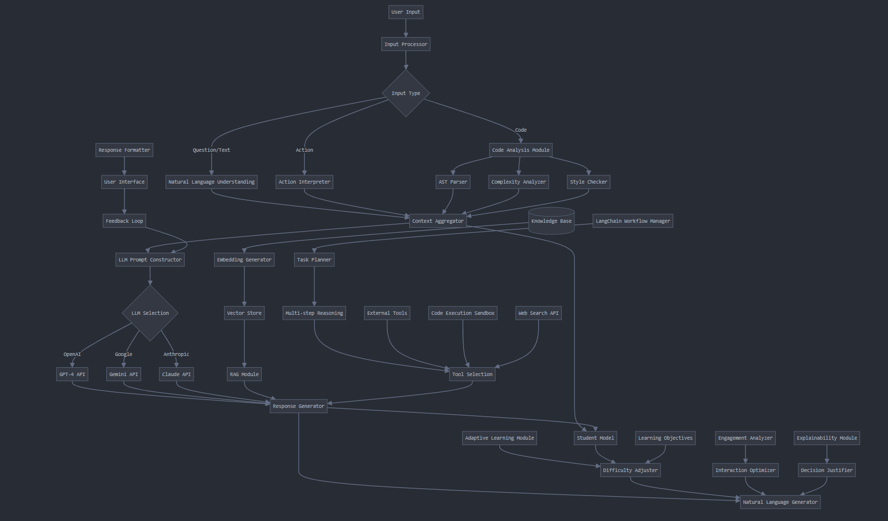

# AI Learning Platform

This project is an AI-powered learning platform that uses the Socratic method to guide students through their learning journey.

## Getting Started

### Prerequisites

- Node.js (v14 or later)
- Python (v3.9 or later)
- Docker and Docker Compose
- pnpm

### Setup

1. Clone the repository
2. Run the setup script:
   ```
   pnpm Scripts/setup.sh
   ```

### Development

To start the development servers:

```
pnpm Scripts/dev.sh
```

### Testing

To run all tests:

```
pnpm test
```

### Building and Deployment

To build all packages:

```
pnpm run build
```

To start the application using Docker:

```
pnpm start
```

## Project Structure

- `apps/`: Contains the main applications (backend and frontend)
- `packages/`: Contains shared packages and the AI agent
- `scripts/`: Contains utility scripts for setup and development

### Directory Structure

- **`apps/`**: Contains the main applications for your project.

  - **`backend/`**: Contains the backend service code.
    - `src/`: The source code for the backend.
      - `api/`: API route definitions.
      - `services/`: Business logic or services.
      - `models/`: Data models.
      - `utils/`: Utility functions.
      - `main.py`: The entry point for the backend application.
    - `tests/`: Backend test cases.
    - `Dockerfile`: Docker configuration for the backend.
    - `requirements.txt`: Python package dependencies.
    - `pyproject.toml`: Python project configuration.
  - **`frontend/`**: Contains the frontend service code.
    - `src/`: The source code for the frontend.
      - `components/`: React components.
      - `pages/`: Page components.
      - `styles/`: CSS or styled components.
      - `utils/`: Utility functions.
      - `App.tsx`: The main React component.
    - `public/`: Static assets.
    - `tests/`: Frontend test cases.
    - `Dockerfile`: Docker configuration for the frontend.
    - `package.json`: Node.js package dependencies.
    - `tsconfig.json`: TypeScript configuration.

- **`packages/`**: Contains shared or additional packages.

  - **`ai-agent/`**: AI-related package with its own source code.
    - `src/`: Source code for the AI agent.
      - `llm/`: Language model related code.
      - `rag/`: Retrieval-augmented generation code.
      - `workflows/`: Workflow definitions.
      - `index.ts`: Entry point for the AI agent package.
    - `tests/`: Tests for the AI agent package.
    - `package.json`: Node.js package dependencies.
    - `tsconfig.json`: TypeScript configuration.
  - **`shared/`**: Contains shared utilities or types.
    - `src/`: Source code for shared components.
      - `types/`: Shared TypeScript types.
      - `utils/`: Shared utility functions.
    - `package.json`: Node.js package dependencies.
    - `tsconfig.json`: TypeScript configuration.

- **`docker-compose.yml`**: Docker Compose configuration for managing multi-container Docker applications.

- **`scripts/`**: Contains shell scripts for setup and development.

  - `setup.sh`: Setup script for the project.
  - `dev.sh`: Development script.

- **`.gitignore`**: Specifies files and directories to ignore in Git.

- **`README.md`**: Project documentation and overview.

- **`package.json`**: Root Node.js package configuration (likely for managing shared dependencies).

- **`tsconfig.json`**: Root TypeScript configuration (likely for shared TypeScript settings).

## Services

### AI Agent flow



## TODO

- [ ] Backend Development
  - [ ] Design DB tables
  - [ ] Implement core services
    - [ ] Auth
    - [ ] User
    - [ ] Content
    - [ ] Learning Path
    - [ ] Code Execution
    - [ ] AI Interaction
- [ ] Frontend Development
  - [ ] Create main UI components
  - [ ] Add WebSocket support for realtime feedback
- [ ] DevOps & Infrastructure
  - [ ] Set up CI/CD pipeline
  - [ ] Configure Kubernetes cluster
- [ ] AI & Learning Features

  - [ ] Integrate AI agent server
  - [ ] Develop code sandbox/editor
  - [ ] Implement feedback loop
  - [ ] Implement student modeling
